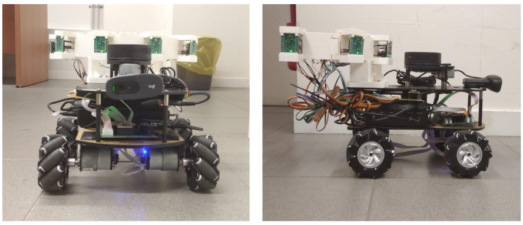
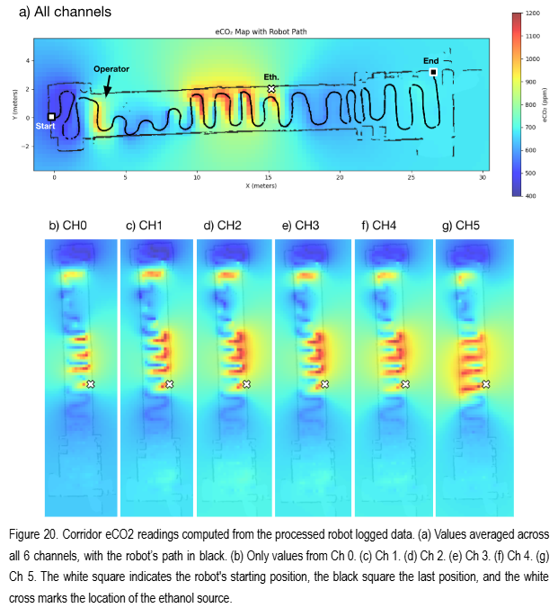

# rUBot eCO₂ Indoor Mapping

ROS 2 Humble project for indoor eCO₂ mapping using **rUBot**, a mobile mecanum-wheeled robot, equipped with an array of ENS160 gas sensors. The robot uses SLAM and Nav2 to autonomously navigate a room, collecting sensor readings and associating each one with the robot's pose at the time of measurement. The recorded data can then be processed offline to generate spatial eCO₂ heatmaps, or visualized live in RViz as the robot explores.

